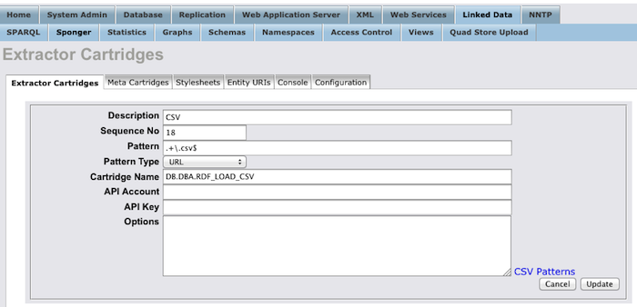
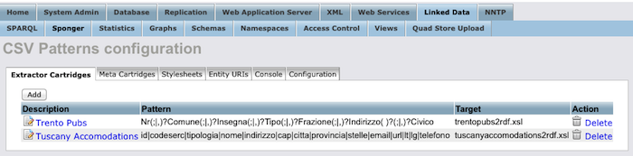

# Transformer configuration for Toscana Restaurants dataset

## Input Data

The following dataset contains information about restaurants in Toscana region
[dati.toscana.it](http://dati.toscana.it/dataset/rt-vetrinatoscana/resource/80020491-6b17-4e1b-94be-bd8d1a41f62a) ([Direct link](http://dati.toscana.it/dataset/75d6183f-8b8d-4150-a1f0-f69eb984c238/resource/80020491-6b17-4e1b-94be-bd8d1a41f62a/download/esportazioneadesioni10102014.csv)).

This CSV dataset contains names, addresses, geolocation and contact information of 2263 restaurants.  A snippet of the original dataset is shown below:

| TIPOLOGIA  | NOME                          | VIA                          | CITTA'                     | CAP   | PROVINCIA | EMAIL                          | TELEFONO   | FAX      | LAT        | LONG       |
|------------|-------------------------------|------------------------------|----------------------------|-------|-----------|--------------------------------|------------|----------|------------|------------|
| RISTORANTE | Bagno Lelia                   | Terrazza della Repubblica 21 | Citt� Giardino, VIAREGGIO  | 55049 | Lucca     | info@bagnolelia.it             | 58450006   | 58450006 | 43.8840098 | 10.2332009 |
| RISTORANTE | Bagno Ristorante il Cavallone | Viale Sergio Bernardini 722  | Lido Di Camaiore, CAMAIORE | 55041 | Lucca     | laura.bagnocavallone@gmail.com | 584610554  |          | 43.9421402 | 10.2969083 |
| RISTORANTE | bagou bally juvenal           | via maromme 30/6             | SIGNA                      | 50058 | Firenze   | ballyjuvenal@gmail.com         | 3927807905 |          | -0         | -0         |

Inspecting original dataset, one can easily identify the following problems:

* Entries in Tipologia column are all in uppercase
* Entries in Nome, Via and Citta columns doesn't have a unified case, part of the entries are uppercase others are lowercase.
* The dataset has encoding problems, such that letters with accent (á, é, í, ó) are lost and can not be recovered. They are replaced with a '�' Unicode replacement character, such that words like _Caffé_, _Localitá_  have a strange question mark symbol instead of an accent letter. 
* Columns "LAT", "LONG" represent GPS coordinates. In some cases entries in this column have values "-0".

We apply two Fusepool transformers on this dataset:

1. **Cleaning:** [Batchrefine transformer](https://github.com/fusepoolP3/p3-batchrefine) to correct the aforementioned errors.

2. **Transform to RDF:** Virtuoso RDF transformer http://fusepool.openlinksw.com/ext/csv is used to transform the cleaned dataset into RDF. Data can be transformed both to RDF/XML or Turtle. 


## Transformed Data

#### 1. Cleaned dataset with Batchrefine

With [Batchrefine transformer](https://github.com/fusepoolP3/p3-batchrefine) we improve the readability and correctness of the dataset. For cleaning procedure we did not want to filter badly formatted entries but instead we tried to correct them. A snippet of the dataset after cleaning is shown below:

| TIPOLOGIA  | NOME                          | VIA                          | CITTA                      | CAP   | PROVINCIA | EMAIL                          | TELEFONO   | FAX      | LAT      | LONG      |
|------------|-------------------------------|------------------------------|----------------------------|-------|-----------|--------------------------------|------------|----------|----------|-----------|
| Ristorante | Bagno Lelia                   | Terrazza Della Repubblica 21 | Citta Giardino, Viareggio  | 55049 | Lucca     | info@bagnolelia.it             | 58450006   | 58450006 | 43.88401 | 10.233201 |
| Ristorante | Bagno Ristorante Il Cavallone | Viale Sergio Bernardini 722  | Lido Di Camaiore, Camaiore | 55041 | Lucca     | laura.bagnocavallone@gmail.com | 584610554  |          | 43.94214 | 10.296908 |
| Ristorante | Bagou Bally Juvenal           | Via Maromme 30/6             | Signa                      | 50058 | Firenze   | ballyjuvenal@gmail.com         | 3927807905 |          |          |           |


#### 2. Transformed to RDF using Virtuoso CSV Transformer

As far as possible the input has been mapped to schema.org types:

* Addresses are mapped to schemaOrg:PostalAddress
* Each organization is of type schemaOrg:Organization, restaurants are also of type schemaOrg:Restaurant, shops also of type schemaOrg:Store.
* Geo coordinates are described in terms of both WGS84 lat/long and schema.org GeoCoordinates.

```rdf
<rdf:RDF
...
	xmlns:sioc="http://rdfs.org/sioc/ns#"
	xmlns:dc="http://purl.org/dc/elements/1.1/"
	xmlns:geo="http://www.w3.org/2003/01/geo/wgs84_pos#"
	xmlns:opl="http://www.openlinksw.com/schema/attribution#"
	xmlns:schema="http://schema.org/"
	xmlns:dcterms="http://purl.org/dc/terms/"
	xmlns:oplbase="http://www.openlinksw.com/schemas/oplbase#" >
...
<rdf:Description rdf:about="http://fusepool.openlinksw.com/tuscany/restaurant#Organization_1_Addr">
    <rdf:type rdf:resource="http://schema.org/PostalAddress" />
    <rdfs:label>Via Carlo Salomone Cammeo 50/52, Pisa</rdfs:label>
    <schema:faxNumber>50555003</schema:faxNumber>
    <schema:streetAddress>Via Carlo Salomone Cammeo 50/52, Pisa</schema:streetAddress>
    <schema:addressLocality>Pisa</schema:addressLocality>
    <schema:Country>IT</schema:Country>
    <schema:addressRegion>Pisa</schema:addressRegion>
    <schema:email>latavernadiemma@alice.it</schema:email>
    <schema:telephone>50555003</schema:telephone>
  </rdf:Description>

<rdf:Description rdf:about="http://fusepool.openlinksw.com/tuscany/restaurant#Organization_2_GeoCoords">
    <rdf:type rdf:resource="http://schema.org/GeoCoordinates" />
    <rdfs:label>42.876716, 11.058269</rdfs:label>
    <schema:latitude>42.876716</schema:latitude>
    <schema:longitude>11.058269</schema:longitude>
  </rdf:Description>

<rdf:Description rdf:about="http://fusepool.openlinksw.com/tuscany/restaurant#Organization_2_Addr">
    <rdf:type rdf:resource="http://schema.org/PostalAddress" />
    <rdfs:label>Via Malenchini, 38, Braccagni, Grosseto</rdfs:label>
    <schema:faxNumber></schema:faxNumber>
    <schema:streetAddress>Via Malenchini, 38, Braccagni, Grosseto</schema:streetAddress>
    <schema:addressLocality>Braccagni, Grosseto</schema:addressLocality>
    <schema:Country>IT</schema:Country>
    <schema:addressRegion>Grosseto</schema:addressRegion>
    <schema:email>ostescuro@vinosteria.com</schema:email>
    <schema:telephone>0564324068 ; 3398781794</schema:telephone>
  </rdf:Description>

<rdf:Description rdf:about="http://fusepool.openlinksw.com/tuscany/restaurant#Organization_3_GeoCoords">
    <rdf:type rdf:resource="http://schema.org/GeoCoordinates" />
    <rdfs:label>43.845696, 10.506369</rdfs:label>
    <schema:latitude>43.845696</schema:latitude>
    <schema:longitude>10.506369</schema:longitude>
  </rdf:Description>
```

## Transformation Configuration

#### 1. Clean and prepare data

Cleaning with [Batchrefine transformer](https://github.com/fusepoolP3/p3-batchrefine) to correct the aforementioned errors in the original dataset.
* Fix entries in columns "TIPOLOGIA,NOME,VIA,CITTA" to titlecase.
* Throughout the dataset, find and replace '�' Unicode replacement character with an appropriate letter.
* In columns "LAT, LONG" set the cell to blank if the value is equal to "-0".
* Remove non-digit characters from the "TELEFONO,FAX" columns. In case of more than one phone number, separate them with ';'.

To use [Batchrefine transformer](https://github.com/fusepoolP3/p3-batchrefine) a transform configuration is required. We use GUI of [OpenRefine](https://github.com/OpenRefine/OpenRefine) to prepare transformation rules that will be further passed to the transformer in a query parameter.
A brief tutorial how to design and extract transformation rules from OpenRefine can be found [here](https://github.com/andreybratus/tutorial).

Transformation rules are extracted from OpenRefine and saved in a JSON file, which we also provide: [esportazioneadesioni_transform.json](esportazioneadesioni_transform.json). Transformation rules are passed to the transformer as a 'refinejson' query parameter together with the input data. An example query is shown below:

```bash
curl -i -XPOST -H 'Content-Type:text/csv' -H 'Accept:text/csv' --data-binary @esportazioneadesioni10102014-cleaned.csv "http://hetzy1.spaziodati.eu:7100/?refinejson=https://raw.githubusercontent.com/fusepoolP3/p3-transformer-configs/master/toscana-restaurants/esportazioneadesioni_transform.json"
```
http://hetzy1.spaziodati.eu:7100 is a public instance of asynchronous Batchrefine transformer, which would return similar response:

```
HTTP/1.1 100 Continue

HTTP/1.1 202 Accepted
Date: Thu, 29 Jan 2015 15:14:54 GMT
Location: /job/b75afaef-9a26-4cf6-b8f1-78a272b9ff66
Transfer-Encoding: chunked
Server: Jetty(9.2.z-SNAPSHOT)
```

to retrieve transformed data, construct the following request using the job id from Location header: **REMEMBER to use your job id**

```bash
	curl -XGET "http://hetzy1.spaziodati.eu:7100/job/b75afaef-9a26-4cf6-b8f1-78a272b9ff66"
```

expected result after cleaning is [esportazioneadesioni10102014-cleaned.csv](esportazioneadesioni10102014-cleaned.csv), which is used to pass to the Virtuoso CSV transformer.

#### 2. Transform cleaned data to RDF

After cleaning the dataset, we apply the **Virtuoso CSV transformer** (http://fusepool.openlinksw.com/ext/csv) to transform it to RDF. The generated RDF can be requested as RDF/XML or Turtle (Example requests for both output types are shown below).

**Trutle**
```bash
curl -i -H "Content-Type: text/csv" -H "Accept: text/turtle"  -H "Content-Location: http://fusepool.openlinksw.com/tuscany/restaurant" --data-binary @esportazioneadesioni10102014-cleaned.csv -X POST "http://fusepool.openlinksw.com/ext/csv"
```

**RDF/XML**
```bash
curl -i -H "Content-Type: text/csv" -H "Accept: application/rdf+xml"  -H "Content-Location: http://fusepool.openlinksw.com/tuscany/restaurant" --data-binary @esportazioneadesioni10102014-cleaned.csv -X POST "http://fusepool.openlinksw.com/ext/csv"
```

which would return similar response:

```
HTTP/1.1 100 Continue

HTTP/1.1 202 Accepted
Server: Virtuoso/07.10.3211 (Linux) x86_64-redhat-linux-gnu  VDB
Connection: Keep-Alive
Content-Type: text/html; charset=UTF-8
Date: Fri, 30 Jan 2015 19:15:36 GMT
Accept-Ranges: bytes
Location: /ext/status/120
Content-Length: 
```

to retrieve data, construct the following request using the job id from Location header: **REMEMBER to use your job id**

```bash
curl -X GET "http://fusepool.openlinksw.com/ext/status/120"
```

The expected results are: [RDF](esportazioneadesioni10102014-transformed.rdf) or [Turtle](esportazioneadesioni10102014-transformed.ttl).

The Virtuoso CSV transformer requires no end-user configuration, insofar as the transformation is expressed in a developer-defined XSLT stylesheet (tuscanyrestaurantsshops2rdf.xsl). The stylesheet and supporting Virtuoso/PL code are packaged and installed via a Fusepool-specific Cartridges VAD. Use of a particular stylesheet for transformation of a specific CSV dataset is triggered by associating the header line of the CSV data with the .xsl stylesheet. This association is set up through the 'CSV Pattern configuration' dialog in Virtuoso's Conductor UI.

<div align="center">

</div>

<div align="center">

</div>

## Example Usages of the Data

The Toscana restaurants dataset provides an immense collection of records representing "restaurants" and "botegas" in the region. The provided information can be used as a basis for online services that facilitate booking and promotion of tourist attractions in the region. By exploiting the geographic locations a user may receive suggestions about nearby restaurants and use the contact information to book a table for dinner.

An example SPARQL query returns Name, telephone number and geographic cordinates of all the restaurants located in "Firenze" city. The query and a snippet of the output result are presented below:

```SPARQL
PREFIX rdf: <http://www.w3.org/1999/02/22-rdf-syntax-ns#>
PREFIX geo: <http://www.w3.org/2003/01/geo/wgs84_pos#>
PREFIX schema: <http://schema.org/>

SELECT ?name ?telephone ?lat ?long 
FROM <http://sandbox.fusepool.info:8181/ldp/toscana-restaurants-1/K-csv-transformed>
WHERE {
  ?restaurant schema:address ?address ;
              schema:name ?name ;              
              geo:lat ?lat ;
              geo:long ?long .
  ?address schema:addressRegion "Firenze" ;
           schema:telephone ?telephone .
}
ORDER BY ?name
```

| name                          | telephone  | lat       | long      |
|-------------------------------|------------|-----------|-----------|
| Acconci Albergo Ristorante    | 3383481933 | 44.118527 | 11.37947  |
| Albego Trattoria La Bruna     | 55406614   | 43.896056 | 11.321064 |
| Albergo Trattoria La Bruna    | 55406614   | 43.896056 | 11.321064 |
| Antica Macelleria Falorni Snc | 55853029   | 43.582435 | 11.316883 |

The presented datset can be also combined with information from datasets containing data about other points of interest in the nearby location. Such advantage can be leverage to provide users with better suggestions about the tourist attractions and directions when traveling in the region.
